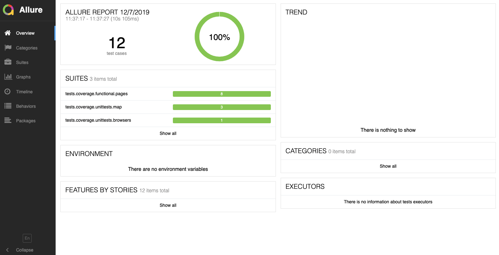

# Python page object model
> Represent most popular OOD pattern for Web UI automation using python programming language.
>
> Automated tests are demonstrated on http://newtours.demoaut.com/mercurywelcome.php web app. Enjoy it!

[](https://travis-ci.org/vyahello/python-page-object)
[](https://coveralls.io/github/vyahello/python-page-object?branch=master)

[](https://www.elegantobjects.org)
[](LICENSE.md)

**Tools**
> - `python 3.6+`
> - `selenium` and `pom`
> - `pytest`
> - `allure` reporting
> - `travis CI`

In addition code is `fully type annotated` and covered with static code analysis tools (`black`, `flake8` and `mypy`).

## Run automated tests
From the root directory of your shell run following commands:

**Smoke tests**
```bash
~ ./run-tests.sh smoke
```

**Unit tests**
```bash
~ ./run-tests.sh unittest
```

**Launch whole set of tests**
```bash
~ ./run-tests.sh all
```

### Tests (html) report sample
Run a bunch of tests (e.g smoke) via following command:
```bash
~ ./run-tests.sh smoke
```

After please open `test-report.html` file to see detailed testing report:


### Generate allure report
Please follow next instruction to generate allure report (mac OS example):
1. Update java via `brew cask install adoptopenjdk`
2. Install allure via `brew install allure`
3. Generate allure project via `allure serve report`



## Release History

* 0.3.0
    * Introduce allure integration
* 0.2.0
    * Introduce travis CI
    * Add static code analysis tools (`black`, `flake8` and `mypy`) along with unittests
* 0.1.0
    * Distribute initial version

## Meta
Author – Volodymyr Yahello vyahello@gmail.com

Distributed under the `MIT` license. See [LICENSE](LICENSE.md) for more information.

You can reach out me at:
* [https://github.com/vyahello](https://github.com/vyahello)
* [https://www.linkedin.com/in/volodymyr-yahello-821746127](https://www.linkedin.com/in/volodymyr-yahello-821746127)

## Contributing
1. clone the repository
2. configure Git for the first time after cloning with your `name` and `email`
3. `pip install -r requirements.txt` to install all project dependencies
4. `pip install -r requirements-dev.txt` to install all project development dependencies
