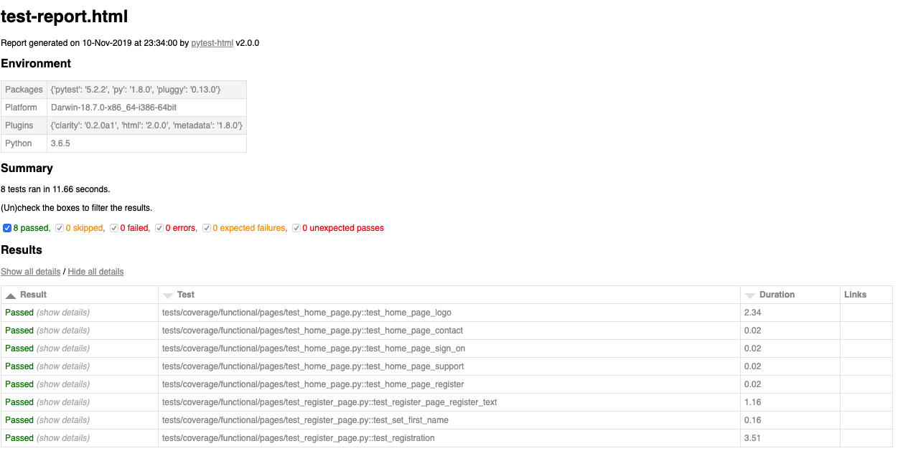

# Page object design pattern implementation in python
Represent most popular OOD pattern for Web UI automation using python programming language.

## Tools
> - `python 3.6+`
> - `selenium` and `pom`
> - `pytest`

### Run automated tests
From the root directory of your shell run next command

**Run smoke tests**
```bash
~ ./run-tests smoke
```

**Run unittest tests**
```bash
~ ./run-tests unittest
```

**Run all tests**
```bash
~ ./run-tests all
```

### Tests report sample
```bash
~ ./run-tests smoke
Project: Pytest Page Object Model
Written by: Volodymyr Yahello                                                                                                                                                                                               
plugins: clarity-0.2.0a1, html-2.0.0, metadata-1.8.0
collected 14 items / 6 deselected / 8 selected

tests/coverage/functional/pages/test_home_page.py::test_home_page_logo PASSED                                                                                                                                                                    [ 12%]
tests/coverage/functional/pages/test_home_page.py::test_home_page_contact PASSED                                                                                                                                                                 [ 25%]
tests/coverage/functional/pages/test_home_page.py::test_home_page_sign_on PASSED                                                                                                                                                                 [ 37%]
tests/coverage/functional/pages/test_home_page.py::test_home_page_support PASSED                                                                                                                                                                 [ 50%]
tests/coverage/functional/pages/test_home_page.py::test_home_page_register PASSED                                                                                                                                                                [ 62%]
tests/coverage/functional/pages/test_register_page.py::test_register_page_register_text PASSED                                                                                                                                                   [ 75%]
tests/coverage/functional/pages/test_register_page.py::test_set_first_name PASSED                                                                                                                                                                [ 87%]
tests/coverage/functional/pages/test_register_page.py::test_registration PASSED                                                                                                                                                                  [100%]

generated html file: test-report.html
=========================================================================================================== 8 passed, 6 deselected in 12.06s ===========================================================================================================
```

Please open `test-report.html` file to see detailed testing report:



## Contributing
- clone the repository
- configure Git for the first time after cloning with your name and email
  ```bash
  git config --local user.name "Volodymyr Yahello"
  git config --local user.email "vyahello@gmail.com"
  ```
- run `pip install -r requirements.txt` to install all required python packages